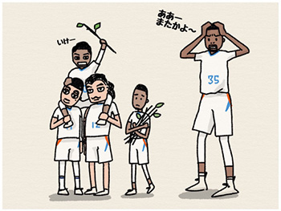
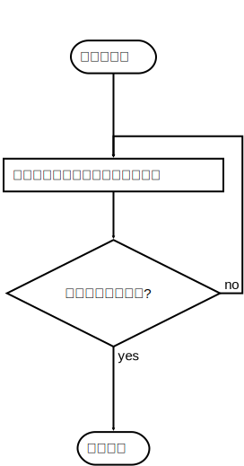

这段时间一直在学习github上的[面向程序员的数据挖掘指南](https://github.com/egrcc/guidetodatamining)，教程本身做得非常棒。但是第八章中的层次聚类算法代码不够精炼，也比较难懂，所以特地改进了一下他的算法代码。


**聚类**是指把一组样本数据按照相似度划分成若干类的过程。

举个例子，中国有句话叫做物以类聚，人已群分，说的就是聚类的事。

暑假过后，大学新生入校，组成了一个班级。刚开始，大家互不认识，每个同学都是在军训教官淫威苦逼度日的独立个体，这就是样本的初始状态：

 

几天过去了。杜兰特同学发现自己与维斯布鲁克同学都酷爱打篮球，所以他们俩就组成了篮球二人组。这就是一次聚类的过程。

 

> 我们是最佳搭档（好吧，曾经是）

又过了几天，罗伯森同学发现跟篮球二人组在一起玩很开心，于是就就加入了篮球二人组，组成了三人的篮球斗牛队。而前几天另外一对——亚当斯与坎特则因为有着同样炫酷的胡子而组成了胡子兄弟。

 

军训过后，转眼到了学校举办的秋季运动会，胡子兄弟与斗牛小分队组成了篮球队代表班级参加学校的篮球赛。

 

同时，这边爱因斯坦与牛顿也没有虚度光阴，他们一起组成了物理研究小组。其它同学也都纷纷组成了LOL联盟，BigBang粉丝团等等小组。刚入学时各自独立的大家，此时都找到了自己的队伍，形成了一个个的“聚类”。

 

实现聚类通常有两种算法——层次聚类与k-means算法。在本文中，我们仅仅讨论最直观的层次聚类算法。

下面是层次聚类算法的运行过程：

1. **将每个对象归为一类， 共得到N类， 每类仅包含一个对象。**（刚开学时，杜兰特，维斯布鲁克，罗伯森，亚当斯，坎特，爱因斯坦，牛顿，老王，大伟，小梁等他们互不认识，相互独立。每个同学都是单独的一个类）
2. **找到最接近的两个类并合并成一类，于是总的类数少了一个。** （几天后，杜兰特与维斯布鲁克组成了篮球二人组，杜兰特与维斯布鲁克就合并成了一类）
3. **重新计算新的类与所有旧类之间的距离。**（计算其它同学与篮球二人组之间的爱好相似度）
4. **重复第2步和第3步，直到最后合并成一个类为止。**

我们可以把这个过程精简一下，删除第三步。因为在第二步中寻找最近的两个类时，必定需要计算类与类之间的距离，所以我们不是真的删除了第三步，而是把第三步并入了第二步中。精简以后的算法流程图如下：


对应的伪代码如下：

```python
def clusting()
	all_class = ['class1','class2','class3'...] # 初始化分类,每个样本是一个分类
    while len(all_class) > 1: # 只剩一个类的时候，结束聚类
        combine_two_nearest_class() # 第二步，找到最近的两个类，合并成一个类
```

有了这个伪代码以后，整个算法看上去就非常的清晰明了了。下面是具体的实现代码：

```python
def clustering(self):
        """ 层次聚类 """

        pool = [row.name for i, row in self.data.iterrows()]  # 初始化分类,每个样本是一个分类
        pl = len(pool)
        while pl > 1:
            temp = []  # 临时数组,纪录两两分类的距离
            for i in range(pl):
                for j in range(pl):
                    if i < j:
                        cluster1 = pool[i]
                        cluster2 = pool[j]
                        dis = self.calc_cluster_distance(cluster1, cluster2)
                        temp.append((dis, (cluster1, cluster2)))
            need_combine_1, need_combine_2 = min(temp)[1]  # 找到距离最近的两个分类
            pool.remove(need_combine_1)
            pool.remove(need_combine_2)
            pool.append([need_combine_1, need_combine_2])  # 把距离最近的两个分类合并成一个分类
            pl = len(pool)
        return pool
```

精简以后代码只剩下不到20行。而且逻辑清晰许多。

想要自己动手的同学，可以自己下载[原教程的狗狗分类数据](https://github.com/egrcc/guidetodatamining/blob/master/code/chapter-8/dogs.csv)，自己动手写一下聚类算法。不想动手的同学，可以[点击下载](/files/hierarchical-clustering.zip)源代码运行一下，看看聚类的结果。打印出来的结果应该是一个数组结构的二叉树：

```python
[[['Chihuahua', 'Yorkshire Terrier'], ['Great Dane', ['Bullmastiff', [['German Shepherd', 'Golden Retriever'], ['Standard Poodle', ['Boston Terrier', ['Brittany Spaniel', ['Border Collie', 'Portuguese Water Dog']]]]]]]]]
```

> 源代码依赖pandas（只是为了方便读取数据）。如果不想安装pandas的话，可以自己重写一下数据读取部分(记得要标准化数据)。

恭喜你已经学会层次聚类啦。

> 上面打印的数组结构的二叉树是不是太难看了，还是原教程提供的打印结果比较美。但是打印过程的代码是不是也让你头大？别担心，我们在[下篇](/post/print-cluster-binary-tree)教程中讨论一种比较简单的打印聚类二叉树的办法。

