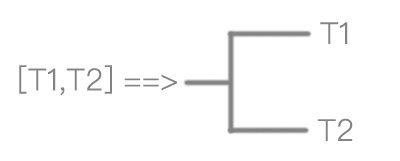
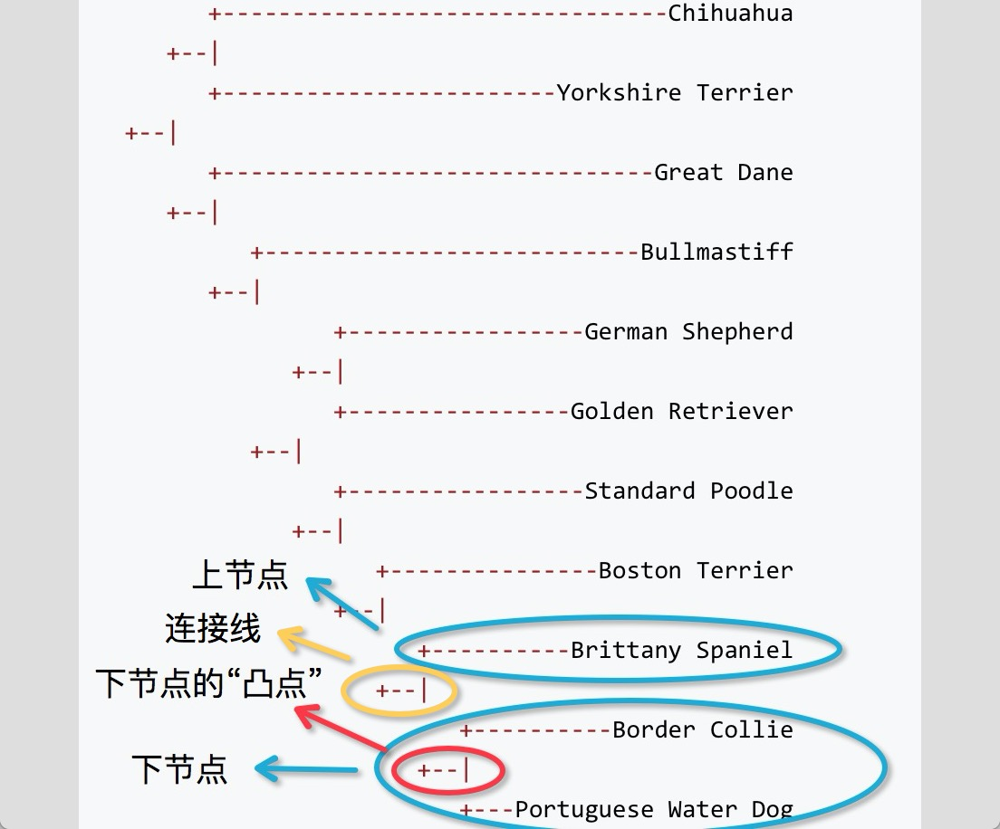

在[上篇](/post/hierarchical-clustering)中，我们学会了如何编写一个层次聚类算法，得到了下面的聚类结果：

```python
cluster = [[['Chihuahua', 'Yorkshire Terrier'], ['Great Dane', ['Bullmastiff', [['German Shepherd', 'Golden Retriever'], ['Standard Poodle', ['Boston Terrier', ['Brittany Spaniel', ['Border Collie', 'Portuguese Water Dog']]]]]]]]]
```

可惜得到的聚类后打印的结果不太直观。而原教程中的打印算法又不是那么容易懂。我们来试试有没有一种更好的办法来得到原教程中的打印结果。

 

> 原教程中打印的结果清晰明了地显示了聚类过程

直觉叫我按照上面的格式一行一行逐行打印，每一行的宽度由节点的深度(depth)决定：

1. 第一行打印：Chihuahua ———————————————+
2. 第二行打印：                                                                              |—+
3. 第三行打印：Yorkshire Terrier   ————————————+
4. ...

看上去可行。可是在实际实现过程的时候，需要展开二叉树成列表。展开过程虽然不会损失每个叶节点的深度信息，但是却会损失聚类信息。比如图中的German Shepherd，Golden Retriever，Standard Poodle都会属于同一深度，但是你却无法知道他们是怎么聚类的。沿着这条思路下去，我们将陷入一团乱麻中不能自拔。 


> 不怕折腾的同学可以按照这个思路试试看。能实现的话，记得告诉我。


暂停一下，整理一下思路：二叉树打印的核心——其实就是打印一个具有**一个父节点**，与**两个子节点**的二叉树。把这个过程画下来就是这样的：

 

用语言来描述一下这个过程会让我们的思路变的更清晰：

1. 打印二叉树的**上节点T1**（计算机教程中是左节点与右节点，为了符合我们的视觉感受，我称其为上节点，下节点）
2. 打印两个节点之间的**连接符号**："---|"
3. 打印二叉树的**下节点T2**。

按照这个思路，我们的打印函数由三个步骤组成:**打印上节点** ==> **打印连接符号** ==> **打印下节点**。


 

> So Easy!

是不是觉得很简单？下面我们来动手实现它。
```python
def print_tree(tree):
	def get_lines(tree, depth):
		""" 获取某棵树的打印字符串 """
		lines = []
		if isinstance(tree, list):  # 此节点是列表,具有子节点
			sub_lines = get_lines(tree[0], depth + 1)  # 获取上节点的打印字符串
			lines.extend(sub_lines)

			lines.append("+--|".rjust((depth + 1) * 3, " "))  # 两个子节点之间的连接符号

			sub_lines = get_lines(tree[1], depth + 1)  # 获取下节点的打印字符串
			lines.extend(sub_lines)
		else:
			lines = ["+---".rjust((depth + 1) * 3, " ") + tree]
		return lines

	lines = get_lines(tree, 1)
	for i in range(len(lines)):
		print lines[i]

tree = [[['Chihuahua', 'Yorkshire Terrier'], ['Great Dane', ['Bullmastiff', [['German Shepherd', 'Golden Retriever'], ['Standard Poodle', ['Boston Terrier', ['Brittany Spaniel', ['Border Collie', 'Portuguese Water Dog']]]]]]]]]

print_tree(tree[0])
```

运行结果：

```python
      	+---Chihuahua
     +--|
        +---Yorkshire Terrier
  +--|
        +---Great Dane
     +--|
           +---Bullmastiff
        +--|
                 +---German Shepherd
              +--|
                 +---Golden Retriever
           +--|
                 +---Standard Poodle
              +--|
                    +---Boston Terrier
                 +--|
                       +---Brittany Spaniel
                    +--|
                          +---Border Collie
                       +--|
                          +---Portuguese Water Dog
```

看上去不错，可是有一些小瑕疵。比如`1.狗狗的名字没有右对齐`，`2.有些类之间的竖向连接没有闭合（如Bullmastiff，与[German Shepherd，Golden Retriever…Portuguese Water Dog])`，`3.另外打印聚类的方向也与原作相反。`

没关系，大方向是对的。我们一步一步来修正这些小细节。

先解决最容易的对齐问题。在打印函数最后的for循环中，我们修改成这样：

```python
max_len = max([len(line) for line in lines])
for i in range(len(lines)):
    line = lines[i]
    if i % 2 == 0:
        fragments = line.split('+---')
        name = fragments[1]
        fragments[1] = "-" * (max_len - len(line)) + fragments[1]
        line = '+---'.join(fragments)  # 右对齐
    print line
```

看一下打印结果：

```python
        +--------------------------------Chihuahua
     +--|
        +------------------------Yorkshire Terrier
  +--|
        +-------------------------------Great Dane
     +--|
           +---------------------------Bullmastiff
        +--|
                 +-----------------German Shepherd
              +--|
                 +----------------Golden Retriever
           +--|
                 +-----------------Standard Poodle
              +--|
                    +---------------Boston Terrier
                 +--|
                       +----------Brittany Spaniel
                    +--|
                          +----------Border Collie
                       +--|
                          +---Portuguese Water Dog
```


看起来很好，再来解决第二个问题，竖向连接线没有闭合的问题。在编码之前，不妨来画个图仔细观察一下：



我们把子节点的连接线"+—|"(红色椭圆部分)，称为子节点的“凸点”。第三个问题的实质情况是连接线与上下节点的凸点之间缺少"|"连接线。如上图的[Border Collie,Portuguese Water Dog]的凸点（红线部分）与连接线（绿线部分）缺少竖线连接符。所以我们先获取子节点的“凸点”(salient)，然后再“凸点”与连接线之间插入"|"。如下：


```python
if len(sub_lines) > 1:  
    salient, index = get_salient(sub_lines)  ＃获取凸点,凸点的行下标
    for i in range(index+1, len(sub_lines)): 
        sub_lines[i] = sub_lines[i][0: salient] + '|' + sub_lines[i][salient+1:]  # 插入"|"
```

来运行一下完整代码：

```python
def print_tree(tree):
    def get_salient(lines):
        """ 获取节点的凸点 """
        return min([(line.find('+'), i) for i, line in enumerate(lines)])
    
    def get_lines(tree, depth):
        """ 获取某棵树的打印字符串 """
        lines = []
        if isinstance(tree, list):  # 此节点是列表,具有子节点
            sub_lines = get_lines(tree[0], depth + 1)  # 获取第一个子节点的打印字符串
            if len(sub_lines) > 1:  # 子节点还有子节点,则打印辅助符号"|",如果此段逻辑不懂。可以注释掉,看一下打印结果you什么区别
                salient, index = get_salient(sub_lines)  # 获取子节点的凸点行(子节点最终聚集在第几行)
                for i in range(index + 1, len(sub_lines)):  # 凸点行以下的行,全部加上"\"符号
                    sub_lines[i] = sub_lines[i][0: salient] + '|' + sub_lines[i][salient + 1:]
            lines.extend(sub_lines)

            lines.append("+--|".rjust((depth + 1) * 3, " "))  # 两个子节点之间的连接符号

            sub_lines = get_lines(tree[1], depth + 1)  # 获取第二个子节点的打印字符串
            if len(sub_lines) > 1:  # 子节点还有子节点,则打印辅助符号"|",如果此段逻辑不懂。可以注释掉,看一下打印结果you什么区别
                salient, index = get_salient(sub_lines)  # 获取子节点的凸点行(子节点最终聚集在第几行)
                for i in range(0, index):  # 凸点行以上的行,全部加上"\"符号
                    sub_lines[i] = sub_lines[i][0: salient] + '|' + sub_lines[i][salient + 1:]
            lines.extend(sub_lines)
        else:
            lines = ["+---".rjust((depth + 1) * 3, " ") + tree]
        return lines

    lines = get_lines(tree, 1)
    max_len = max([len(line) for line in lines])
    for i in range(len(lines)):
        line = lines[i]
        if i % 2 == 0:
            fragments = line.split('+---')
            name = fragments[1]
            fragments[1] = "-" * (max_len - len(line)) + fragments[1]
            line = '+---'.join(fragments)  # 右对齐
        print line

tree = [[['Chihuahua', 'Yorkshire Terrier'], ['Great Dane', ['Bullmastiff', [['German Shepherd', 'Golden Retriever'], ['Standard Poodle', ['Boston Terrier', ['Brittany Spaniel', ['Border Collie', 'Portuguese Water Dog']]]]]]]]]

print_tree(tree[0])
```

打印结果如下：

```python
      	+--------------------------------Chihuahua
     +--|
     |  +------------------------Yorkshire Terrier
  +--|
     |  +-------------------------------Great Dane
     +--|
        |  +---------------------------Bullmastiff
        +--|
           |     +-----------------German Shepherd
           |  +--|
           |  |  +----------------Golden Retriever
           +--|
              |  +-----------------Standard Poodle
              +--|
                 |  +---------------Boston Terrier
                 +--|
                    |  +----------Brittany Spaniel
                    +--|
                       |  +----------Border Collie
                       +--|
                          +---Portuguese Water Dog
```

很完美！是不是有点眼花缭乱了。喝杯咖啡休息一下吧。


第三个小瑕疵就不在这里解决了，也很简单。完整的代码可以[点击这里下载](/files/print-cluter-tree.zip)。

> 遇到问题可以先解决问题的简单版本，再一点一点解决问题的全部。